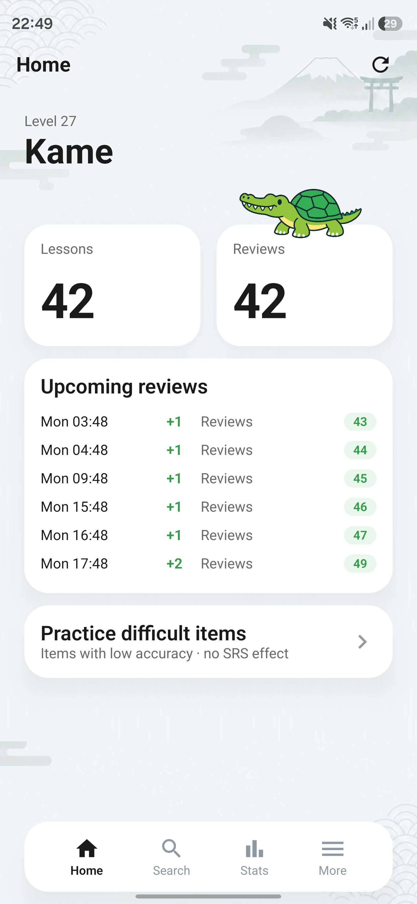
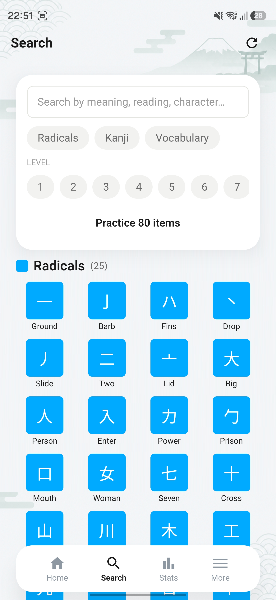
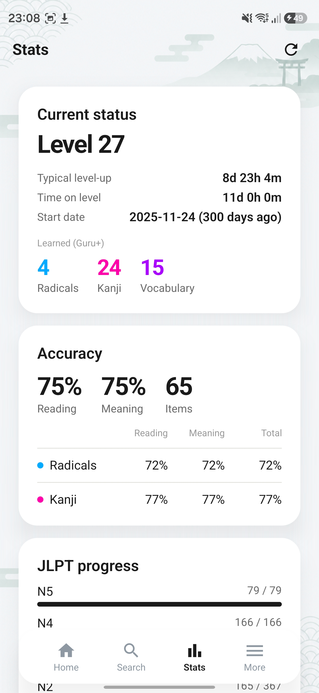
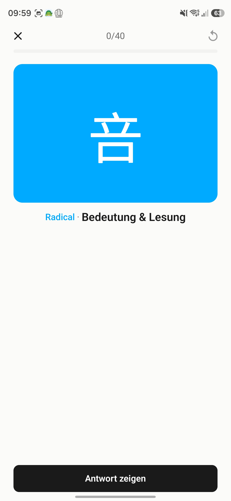
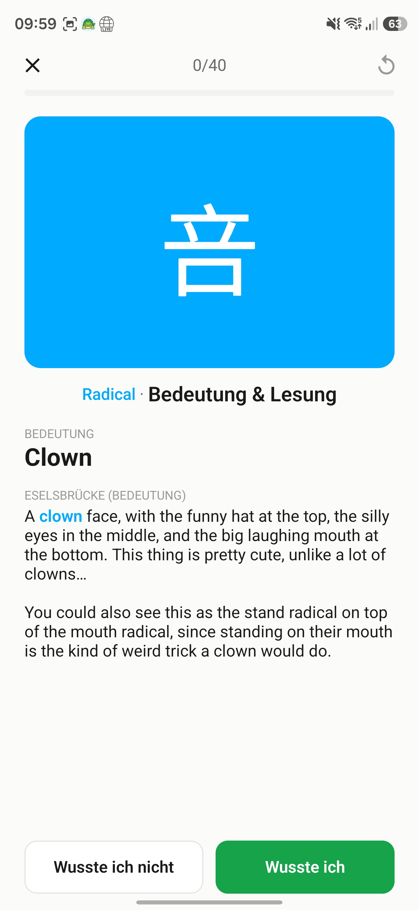
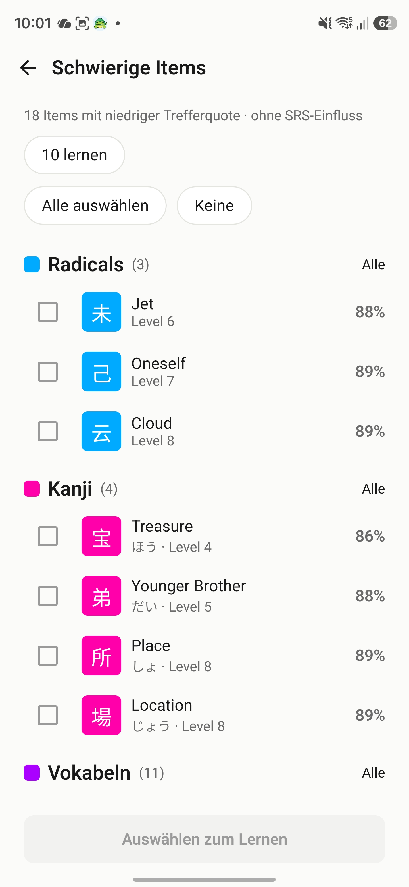

# WaniKame

**Minimalist, free [WaniKani](https://www.wanikani.com) client for Android.**

Your API token stays encrypted on your device. No server, no ads, no tracking.

## 📸 Screenshots

## 📥 Download

Get the latest APK from **[Releases](https://github.com/trunkten/wanikame-releases/releases/latest)**:

1. Download `WaniKame-vX.Y.Z.apk`
2. Open and install it (allow "install from unknown sources" if prompted)
3. Add a [WaniKani API token](https://www.wanikani.com/settings/personal_access_tokens) in the app

> Unofficial client – an active WaniKani subscription is required.

## ✨ Features

- **Reviews & lessons** – Anki mode (reveal & self-grade, optionally meaning and reading separately) or typing with forgiving typo tolerance; a teach step, undo and a live view of the new SRS stage. Configurable review order (SRS, by type, by level or shuffled) and session size. The order of the info sections (components, meaning, reading, mnemonics) is freely configurable, and tapping a component opens its details.
- **Kanji readings** – WaniKani's preferred reading is highlighted, with on'yomi / kun'yomi / nanori. A bundled Japanese font (Noto Sans JP) ensures consistent, correct glyphs on every device.
- **Home** – a clean design with progress, a preview of the reviews coming up over the next hours and a practice screen for difficult items (low accuracy).
- **Statistics** – SRS distribution, accuracy per type, level-up time, account status (start / reset date) and JLPT coverage per level.
- **Audio** – play pronunciation (optional autoplay), selectable voice, background offline download with a progress notification.
- **Home screen widgets** – due reviews or lessons at a glance; card color, transparency and text color fully customizable.
- **App shortcuts** – long-press the app icon: lessons, reviews, search, statistics.
- **Browser** – grouped by type in a grid, with search & level filter.
- **Notifications** – local reminders for due reviews (threshold & optional quiet hours); a tap opens reviews directly.
- **Offline-capable** – answers are stored locally and synced later.
- **App language** – German, English or follow the system.
- **Light / Dark / System** (OLED black).

## ☕ Support

The app is and stays free – no ads, no tracking. If you like it and want to support development, I'd appreciate a coffee:

**[ko-fi.com/patojp](https://ko-fi.com/patojp)**

## 🔤 Font

Japanese characters are set in **Noto Sans JP** (© 2014–2021 Adobe, "Noto" is a trademark of Google Inc.), licensed under the [SIL Open Font License 1.1](https://openfontlicense.org/open-font-license-official-text/).

## ⚖️ Notice

Unofficial client. WaniKani is a trademark of Tofugu LLC and is not affiliated with this project.
